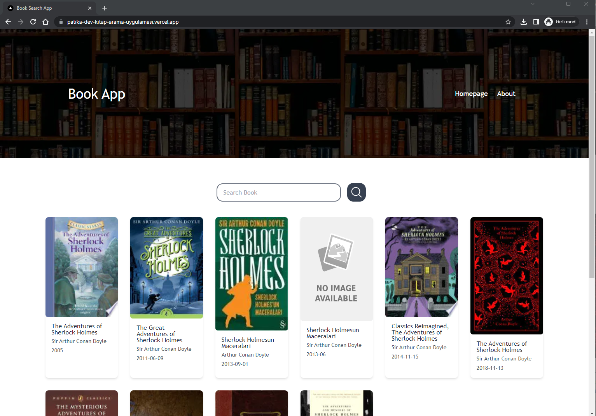

# Patika.dev Kitap Arama Uygulaması

Bu uygulama, [Google Books API](https://developers.google.com/books/docs/overview?hl=tr) kullanılarak yapılmıştır. Uygulama, aranan kelimeye göre kitapların listelendiği ve detaylarına gidilebildiği bir uygulamadır.

## - [Canlı - Live](https://patika-kitap-arama-uygulamasi.vercel.app/)

# Kurulum

Uygulamayı yerel cihazınınzda çalıştırmak için şu adımları izleyin:

1. Bu depoyu kopyalayın ve klasörü açın:

```bash
git clone https://github.com/biskendr/Patika.dev-kitap-arama-uygulamasi
cd Patika.dev-kitap-arama-uygulamasi
```

2. Bağımlılıkları yükleyin:

```bash
npm install
```

3. Uygulamayı başlatın:

```bash
npm run dev
```

4. Uygulamayı görüntülemek için tarayıcınızda http://localhost:3000 adresine gidin.

# Ekran Görüntüsü

<div align="center">  
  
</div>

# Gereksinimler

[Google Books API](https://developers.google.com/books/docs/overview?hl=tr) veya herhangi başka bir API ile kullanıcıların kitap veya yazar ismi yazarak kitap arayabileceği bir servis geliştirmeniz gerekiyor.


### Uygulama Gereksinimleri

- Input'a girilecek olan ifadeye uygun sonuçlar getirilmeli ve ekranda listelenmeli.
- Arama sonuçları sadece ilgili form submit edildiğinde gösterilmeli.
- Sonuçlarda kitapların kapak fotoğrafları bulunmalı.
- Kitap listesinde "detay" adında bir buton olmalı ve bu butona tıklandığında kitap ile alakalı detay bilgiler verilmeli (sayfa sayısı, yayın tarihi vs.) Detay bilgilerini farklı bir sayfada da gösterebilirsiniz, bir modal açtırarak da gösterebilirsiniz.

### API

- [Tıklayın](https://developers.google.com/books/docs/overview?hl=tr)

### Örnek Çalışma

- [Tıklayın](https://fethica.github.io/BookSearch-React/)
